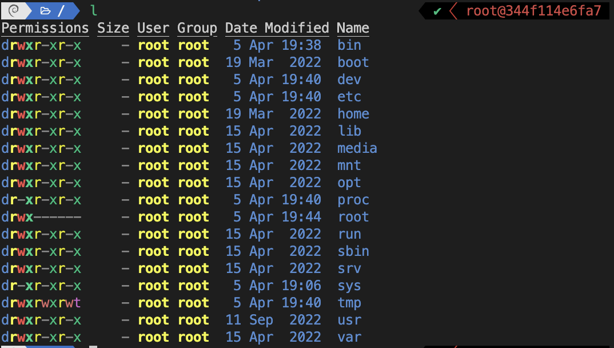

# zsh

Custom Zsh environment with Oh My Zsh and Powerlevel10k theme. Who doesnt want a fancy terminal?

The base image [zshusers/zsh](https://hub.docker.com/r/zshusers/zsh/) is build on top of [minideb](https://hub.docker.com/r/bitnami/minideb).



## Usage

```bash
docker build -t zsh . \
&& docker run -it --rm zsh
```
